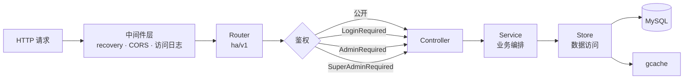

<div align="center">

# hertz-admin

**基于 CloudWeGo Hertz 的生产级 Go 后端项目脚手架**

分层架构 · 统一错误码 · 三级权限 · 国密加密 · 一键部署

[](https://go.dev)
[](https://github.com/cloudwego/hertz)
[](https://gorm.io)
[](./LICENSE)
[](https://github.com/gjing1st/hertz-admin/pulls)

</div>

---

## 📌 这是什么

一个**开箱即用的 Go 后端工程骨架**，不是又一个 demo。

它把后端项目从零搭建时要重复写的那些东西——分层结构、错误码体系、权限中间件、日志、配置、版本注入、容器化部署——全部固化下来。你 clone 下来改业务逻辑就行，不用再纠结目录怎么分、错误怎么返、权限怎么拦。

底层用字节跳动开源的 **Hertz**（当前 Go 生态性能最好的 HTTP 框架之一），工程布局遵循 **golang-standards/project-layout** 标准，并**内置国密 SM3/SM4 算法**，适配信创场景。

## ✨ 核心特性

| 特性 | 说明 |
|---|---|
| 🚀 **高性能底座** | CloudWeGo Hertz，基于 netpoll 的非阻塞 I/O |
| 📐 **标准分层** | `router → controller → service → store → model` 单向依赖，golang-standards 布局 |
| 🔢 **统一错误码** | 所有 error 收敛为可观测错误码，业务码与 HTTP 状态码分离 |
| 🔐 **三级权限模型** | 登录态 / 管理员 / 超级管理员，中间件按路由组注册 |
| 🛡️ **国密算法内置** | SM3、SM4（CBC/ECB/CFB/OFB）、SM4-GCM，密码以 HMAC-SM3 存储 |
| 🔒 **登录安全** | 密码错误次数累计与锁定（防爆破）、完整性校验、密码有效期 |
| 📝 **结构化日志** | logrus + lumberjack，支持标准输出/文件、日志切割、调用者信息 |
| 🏷️ **版本注入** | 借鉴 K8s 做法，编译期把 git tag/commit 写入二进制并暴露 `/version` 接口 |
| 🐳 **容器化就绪** | 多架构 Dockerfile + docker-compose + K8s Deployment + Jenkinsfile |
| 🧪 **单元测试** | 缓存、加解密、错误码、国密、随机数等核心模块均有测试用例 |

## ⚡ 60 秒跑起来

**前置条件**：Go 1.26+、一个可连的 MySQL。

```bash
# 1. 克隆
git clone https://github.com/gjing1st/hertz-admin.git
cd hertz-admin

# 2. 改数据库配置（configs/config.yml）
#    database.host / username / password / dbname

# 3. 启动
make run
```

服务默认监听 **9680** 端口。数据库和数据表会**自动创建**，并注入一个超级管理员账号：

| 账号 | 密码 |
|---|---|
| `superAdmin12` | `Best@213` |

> ⚠️ 首次登录后请立刻修改默认密码，生产环境请务必替换。

验证服务是否正常：

```bash
curl http://localhost:9680/ha/v1/ping     # -> "pong"
curl http://localhost:9680/ha/v1/version  # -> 版本信息
```

接口文档（Swagger）已经挂好，浏览器直接打开：

```
http://localhost:9680/swagger/index.html
```

## 🧭 请求流转



## 📁 目录结构

```shell
├── build
│   ├── ci                  # 持续集成打包脚本
│   └── docker              # Dockerfile（支持多架构）
├── cmd
│   └── ha                  # 主程序入口
├── configs
│   └── config.yml          # 应用配置
├── deployments
│   ├── docker-compose      # Docker Compose 部署
│   ├── jenkins             # Jenkins Pipeline
│   └── k8s                 # Kubernetes Deployment
├── docs                    # Swagger 文档（自动生成）
├── internal
│   ├── apiserver           # 核心业务（MCSS 分层）
│   │   ├── controller      # 控制器：参数校验、响应封装
│   │   ├── router          # 路由注册与权限分组
│   │   ├── service         # 业务逻辑
│   │   ├── store           # 数据访问（database / cache / 初始化数据）
│   │   └── model           # entity / dict / request / response
│   └── pkg                 # 内部公共能力
│       ├── middleware      # 鉴权中间件
│       ├── config          # 配置加载
│       └── functions       # 日志封装
├── pkg
│   ├── errcode             # 统一错误码定义
│   ├── global              # 全局变量与错误
│   └── utils               # 工具集（国密 gm / uuid / slice / map ...）
├── scripts                 # 环境与构建脚本
├── version                 # 版本信息（编译期注入）
└── Makefile
```

## 🛡️ 国密支持

`pkg/utils/gm` 提供符合国密标准的算法实现，可直接用于等保、密评场景：

| 算法 | 实现 | 模式 |
|---|---|---|
| SM3 | `gm.Sm3Sum()` / `gm.New()` | 摘要、HMAC |
| SM4 | `gm.NewCipher()` | CBC、ECB、CFB、OFB |
| SM4-GCM | `gm` 包内 GCM 封装 | 认证加密 |

**密码存储方式**：`base64(HMAC-SM3(key=用户名, data=明文密码))`

```go
// 加密
cipher := gm.EncryptPasswd(username, password)

// 校验（常量时间比较，防时序攻击）
ok := gm.CheckPasswd(username, password, cipher)
```

配合用户表上的 `err_num`（错误次数累计）与 `pwd_updated_at`（密码有效期），构成一套完整的登录安全策略。

> 国密算法实现参考自苏州同济金融科技研究院的开源实现（Apache-2.0），版权声明保留在源文件中。

## 🔑 权限模型

三级角色，通过中间件在路由组上声明式注册：

```go
// internal/apiserver/router/v1/auth.go
initSys(r)              // 登录即可访问
initAuthAdminRouter(r)  // 需管理员权限
initSuperAdminRouter(r) // 需超级管理员权限
```

| 角色 ID | 角色 | 中间件 |
|---|---|---|
| 1 | 超级管理员 | `middleware.SuperAdminRequired()` |
| 2 | 管理员 | `middleware.AdminRequired()` |
| — | 已登录用户 | `middleware.LoginRequired()` |

鉴权走 `Authorization: Bearer <token>`，校验通过后将 `userId` / `username` / `roleId` 注入请求上下文供后续使用。

## 🔢 错误码体系

所有错误统一收敛到 `pkg/errcode`，业务错误码与 HTTP 状态码解耦，前端可据此做精确提示：

```go
// 定义
var (
    Success       = New(0, "success")
    ServerError   = New(10000, "服务内部错误")
    DBError       = New(10001, "数据库操作失败")
    ...
)

// 使用
c.JSON(http.StatusOK, response.Fail(errcode.DBError))
```

## 🔨 构建与打包

```bash
make help          # 查看全部可用命令

make run           # 本地运行
make build         # 编译二进制（自动注入 git 版本信息）
make docker        # 构建镜像并导出 tar.gz
make push_docker   # 推送到镜像仓库

make swag          # 重新生成 Swagger 文档
```

版本信息由 `version/version.sh` 在编译期通过 `-ldflags` 注入，运行时通过 `GET /ha/v1/version` 查询，包含 `gitVersion`、`gitCommit`、`gitTreeState`、`buildDate`、`goVersion`、`platform`。

## 🚢 部署

### Docker Compose

```bash
cd deployments/docker-compose
docker-compose up -d
```

> `docker-compose.yml` 中默认包含一个前端服务，仅需后端时删除 `frontend` 段即可；同时请确认 `image` 名称与 `make docker` 实际产出的镜像名一致。

### Kubernetes

```bash
kubectl apply -f deployments/k8s/ha-deployment.yaml
```

### 配置说明

`configs/config.yml` 主要配置项：

| 配置项 | 默认值 | 说明 |
|---|---|---|
| `base.port` | `9680` | 服务监听端口 |
| `base.dbtype` | `mysql` | 数据库类型 |
| `base.cachetype` | `gcache` | 缓存类型（内存缓存） |
| `base.enableIntegrity` | `true` | 是否开启数据完整性校验 |
| `base.pwdMaxErrNum` | `5` | 密码最大错误次数 |
| `log.output` | `std` | 日志输出：`std` / `file` |
| `log.level` | `info` | 日志级别 |
| `database.*` | — | MySQL 连接信息与连接池参数 |

## 🔌 内置接口

| 方法 | 路径 | 说明 | 权限 |
|---|---|---|---|
| GET | `/ha/v1/ping` | 健康检查 | 公开 |
| GET | `/ha/v1/version` | 版本信息 | 公开 |
| GET | `/ha/v1/login-type` | 支持的登录方式 | 公开 |
| GET | `/ha/v1/init/step` | 初始化状态 | 公开 |
| POST | `/ha/v1/user/login` | 登录 | 公开 |
| POST | `/ha/v1/user/register` | 注册 | 公开 |
| POST | `/ha/v1/logout` | 登出 | 公开 |
| GET | `/ha/v1/sys/run` | 系统运行时长 | 已登录 |
| GET | `/ha/v1/sys/status` | 系统运行状态 | 已登录 |
| GET | `/swagger/index.html` | 接口文档 | — |

## 🗺️ Roadmap

- [ ] **多数据库适配**：`store/db.go` 中已预留 PostgreSQL / openGauss / 人大金仓 / 达梦 / SQLite / ClickHouse 的适配代码，欢迎共建打通
- [ ] **CI 流水线**：补充 GitHub Actions（构建、Lint、单元测试）
- [ ] **镜像命名统一**：对齐 `Makefile` 产物名（`ha-server`）与 docker-compose 中的服务镜像名
- [ ] **可选组件**：Casbin 权限模型、Redis 缓存实现、Wire 依赖注入
- [ ] **在线文档站**：基于 GitHub Pages 搭建使用文档
- [ ] **性能基准**：补充框架基准测试并与同类脚手架横向对比

## 🤝 参与贡献

欢迎 Issue 与 PR。

1. Fork 本仓库
2. 新建分支 `git checkout -b feature/your-feature`
3. 提交改动 `git commit -m 'feat: your feature'`
4. 推送分支 `git push origin feature/your-feature`
5. 提交 Pull Request

如果这个项目对你有帮助，欢迎点个 **Star** ⭐ —— 这是我持续维护下去的最大动力。

## 📄 License

[Apache License 2.0](./LICENSE)

---

## 📞 关于我

- 主要从事后端开发，兼具前端、运维及全栈工程师，热爱 `Golang`、`Docker`、`Kubernetes`、`KubeSphere`
- 信创服务器 `K8s` & `KubeSphere` 布道者、`KubeSphere` 离线部署布道者
- 公众号：`编码如写诗`，作者：`天行1st`，微信：`sd_zdhr`

可扫描下方二维码，添加我微信或关注公众号，添加好友请备注 **`ha`**

|  |
| ------------------------------------------------------------ |
