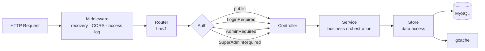

<div align="center">

# hertz-admin

**A production-grade Go backend scaffold built on CloudWeGo Hertz**

Layered architecture · Unified error codes · Three-tier RBAC · Chinese SM crypto · Multi-database support · One-command deploy

[](https://go.dev)
[](https://github.com/cloudwego/hertz)
[](https://gorm.io)
[](./LICENSE)
[](https://github.com/gjing1st/hertz-admin/pulls)

[中文文档](./README.md) | **English**

</div>

---

## 📌 What is this

A **batteries-included Go backend skeleton** — not another demo.

It locks down everything you would otherwise rewrite from scratch on every new service: layered structure, an error-code system, auth middleware, logging, configuration, build-time version injection, and containerized deployment. Clone it, replace the business logic, and skip the "how should I organize the directories / how should errors be returned / how should permissions be enforced" phase.

It runs on **Hertz**, ByteDance's open-source HTTP framework (one of the fastest in the Go ecosystem), follows the **golang-standards/project-layout** convention, and ships with **built-in Chinese national cryptography (SM3/SM4)** for compliance-driven environments that mandate it.

All dependencies are **vendored** in the repository, so the project builds in fully air-gapped networks with no proxy and no internet access.

## ✨ Features

| Feature | Description |
|---|---|
| 🚀 **High-performance core** | CloudWeGo Hertz, built on non-blocking I/O via netpoll |
| 📐 **Standard layering** | `router → controller → service → store → model`, one-way dependencies, golang-standards layout |
| 🔢 **Unified error codes** | Every error converges into an observable error code; business codes decoupled from HTTP status |
| 🔐 **Three-tier permission model** | Authenticated / Admin / Super Admin, registered per route group via middleware |
| 🛡️ **Chinese SM crypto built in** | SM3, SM4 (CBC/ECB/CFB/OFB), SM4-GCM; passwords stored as HMAC-SM3 |
| 🗄️ **Multi-database support** | Adapters ready for MySQL / PostgreSQL / openGauss / KingbaseES / DM (达梦) / SQLite / ClickHouse; MySQL enabled by default, others opt-in |
| 🔒 **Login hardening** | Failed-attempt counting and account lockout (brute-force protection), integrity checks, password expiry |
| 📝 **Structured logging** | logrus + lumberjack; stdout or file output, log rotation, caller info |
| 🏷️ **Version injection** | K8s-style: git tag/commit injected at build time, exposed via a `/version` endpoint |
| 🐳 **Container ready** | Multi-arch Dockerfile + docker-compose + K8s Deployment + Jenkinsfile |
| 📦 **Offline-ready** | Complete `vendor/` tree committed, so builds work without any network access |
| 🧪 **Unit tests** | Test cases for cache, crypto, error codes, SM algorithms, random utilities |

## ⚡ Quick start (60 seconds)

**Requirements**: Go 1.27+ and a reachable MySQL instance.

```bash
# 1. Clone
git clone https://github.com/gjing1st/hertz-admin.git
cd hertz-admin

# 2. Edit database settings (configs/config.yml)
#    database.host / username / password / dbname

# 3. Run
make run
```

The service listens on port **9680** by default. The database and tables are created **automatically**, and a super-admin account is seeded:

| Username | Password |
|---|---|
| `superAdmin12` | `Best@213` |

> ⚠️ Change the default password immediately after your first login, and always replace it in production.

Verify the service is up:

```bash
curl http://localhost:9680/ha/v1/ping     # -> "pong"
curl http://localhost:9680/ha/v1/version  # -> version info
```

Swagger UI is already wired up — just open it in a browser:

```
http://localhost:9680/swagger/index.html
```

## 📦 Offline / air-gapped builds (vendor)

The repository ships a complete `vendor/` directory (2004 files, ~64 MB) containing every dependency source file. **No proxy, no module cache, and no internet access are required to build.**

> ⚠️ Committing `vendor/` grows the repository by ~64 MB and makes `git clone` correspondingly slower. That is the price of offline buildability — usually worth it for air-gapped or compliance-constrained environments.

### Build offline

Because `go.mod` declares a Go version ≥ 1.14 and a `vendor/modules.txt` is present, Go automatically switches to vendor mode — no extra flags needed:

```bash
make run      # runs against the vendored sources
make build    # produces the ha binary
```

To be explicit (and to guarantee vendor mode even if the tree changes), pass the flag yourself:

```bash
go build -mod=vendor -trimpath -o ha ./cmd/ha/main.go
go run -mod=vendor ./cmd/ha/main.go
go test -mod=vendor ./...
```

To make vendor mode permanent and immune to accidental network access, commit this env var into your build scripts:

```bash
go env -w GOFLAGS=-mod=vendor
```

### Keep vendor in sync

`vendor/` is a **generated** artifact. Whenever you change dependencies, regenerate it and commit the result:

```bash
go get github.com/some/module@v1.2.3   # add or bump a dependency (needs network once)
go mod tidy                            # clean up go.mod / go.sum
go mod vendor                          # regenerate vendor/ ← always do this
go mod verify                          # verify module integrity
```

Three rules worth remembering:

1. **`go.sum` must be committed.** It is the integrity manifest vendor mode relies on.
2. **Never hand-edit `vendor/`.** Changes are wiped on the next `go mod vendor`.
3. **`vendor/modules.txt` must stay consistent with `go.mod`.** If they drift, Go fails with `inconsistent vendoring`. Run `go mod vendor` again to fix it.

### Build the image offline

`build/docker/Dockerfile` **is already written for vendor mode**: no GOPROXY, no `go mod download` — it compiles directly with `go build -mod=vendor`, so it works on an air-gapped network as well:

```bash
make docker
```

```dockerfile
ARG GO_VERSION=1.27.1
ARG ALPINE_VERSION=3.24
FROM  golang:${GO_VERSION}-alpine${ALPINE_VERSION} AS build
ARG LDFLAGS
WORKDIR /src
# Dependencies are vendored: no GOPROXY, no go mod download — builds offline
ENV GOTOOLCHAIN=local
RUN --mount=type=cache,target=/root/.cache/go-build \
    --mount=type=bind,target=. \
    CGO_ENABLED=0 GOOS=linux go build -mod=vendor -trimpath -ldflags="-s -w ${LDFLAGS}" -o /bin/server ./cmd/ha/main.go

FROM alpine:${ALPINE_VERSION}
COPY --from=build /bin/server /bin/
EXPOSE 9680
ENTRYPOINT [ "/bin/server" ]
```

> ❗ **Two prerequisites for offline builds**: ① the base images `golang:1.27.1-alpine3.24` and `alpine:3.24` must already be imported locally (`docker save` / `docker load`, or via a private registry); ② `GO_VERSION` must not be lower than the version declared in `go.mod`. The Dockerfile sets `ENV GOTOOLCHAIN=local`, so a version mismatch fails fast instead of quietly downloading a toolchain — on a network-less machine the latter only looks like a long hang or timeout.

> ❗ **`.dockerignore` now carries a `!vendor/**` exception — do not remove it.** The template's own `**/obj` rule also excludes `vendor/github.com/twitchyliquid64/golang-asm/obj`, which is a Go **source** package (69 `.go` files), not a build artifact. Without it, `go build -mod=vendor` fails outright:
>
> ```
> vendor/github.com/twitchyliquid64/golang-asm/asm/arch/arch.go:9:2:
> cannot find module providing package github.com/twitchyliquid64/golang-asm/obj:
> import lookup disabled by -mod=vendor
> ```
>
> Whenever you add broad rules such as `**/bin` or `**/obj`, double-check that they do not reach into `vendor/`. Also keep `vendor/` commented out in `.gitignore`, otherwise the directory is never committed.

## 🧭 Request flow



## 📁 Project layout

```shell
├── build
│   ├── ci                  # CI packaging scripts
│   └── docker              # Dockerfile (multi-arch)
├── cmd
│   └── ha                  # main entrypoint
├── configs
│   └── config.yml          # application config
├── deployments
│   ├── docker-compose      # Docker Compose deployment
│   ├── jenkins             # Jenkins pipeline
│   └── k8s                 # Kubernetes Deployment
├── docs                    # Swagger docs (generated)
├── internal
│   ├── apiserver           # core business logic (MCSS layering)
│   │   ├── controller      # controllers: validation, response wrapping
│   │   ├── router          # route registration and permission groups
│   │   ├── service         # business logic
│   │   ├── store           # data access (database / cache / seed data)
│   │   └── model           # entity / dict / request / response
│   └── pkg                 # internal shared capabilities
│       ├── middleware      # auth middleware
│       ├── config          # config loading
│       └── functions       # logging wrapper
├── pkg
│   ├── errcode             # unified error codes
│   ├── global              # global variables and errors
│   └── utils               # utilities (gm / uuid / slice / map ...)
├── scripts                 # environment and build scripts
├── vendor                  # vendored dependencies (offline builds)
├── version                 # version info (injected at build time)
└── Makefile
```

## 🛡️ Chinese SM cryptography

The `pkg/utils/gm` package implements Chinese national cryptographic standards, ready for MLPS (等保) and cryptographic-evaluation (密评) scenarios:

| Algorithm | Implementation | Modes |
|---|---|---|
| SM3 | `gm.Sm3Sum()` / `gm.New()` | digest, HMAC |
| SM4 | `gm.NewCipher()` | CBC, ECB, CFB, OFB |
| SM4-GCM | GCM wrapper in the `gm` package | authenticated encryption |

**Password storage**: `base64(HMAC-SM3(key=username, data=plaintext password))`

```go
// Encrypt
cipher := gm.EncryptPasswd(username, password)

// Verify (constant-time comparison, resistant to timing attacks)
ok := gm.CheckPasswd(username, password, cipher)
```

Combined with `err_num` (failed-attempt counter) and `pwd_updated_at` (password expiry) on the user table, this forms a complete login-security policy.

> The SM algorithm implementation is based on the open-source work of the Suzhou Tongji Fintech Research Institute (Apache-2.0); the original copyright notice is preserved in the source files.

## 🔑 Permission model

Three roles, declared directly on route groups through middleware:

```go
// internal/apiserver/router/v1/auth.go
initSys(r)              // any authenticated user
initAuthAdminRouter(r)  // requires admin
initSuperAdminRouter(r) // requires super admin
```

| Role ID | Role | Middleware |
|---|---|---|
| 1 | Super Admin | `middleware.SuperAdminRequired()` |
| 2 | Admin | `middleware.AdminRequired()` |
| — | Authenticated user | `middleware.LoginRequired()` |

Auth uses `Authorization: Bearer <token>`. On success, `userId` / `username` / `roleId` are injected into the request context for downstream use.

## 🗄️ Multi-database support

`internal/apiserver/store/db.go` implements adapters for seven databases, covering driver selection, DSN construction, and automatic database creation:

| Database | `base.dbtype` | Driver | Auto-create DB |
|---|---|---|---|
| MySQL | `mysql` | `gorm.io/driver/mysql` | ✅ |
| PostgreSQL | `postgresql` | `gorm.io/driver/postgres` | ✅ |
| openGauss | `opengauss` | `gorm.io/driver/postgres` (protocol compatible) | ✅ |
| KingbaseES (人大金仓) | `kingbase` | `gorm.io/driver/postgres` (PG mode) | ✅ |
| DM (达梦) | `dm` | `github.com/nfjBill/gorm-driver-dm` | — |
| SQLite | `sqlite` | `gorm.io/driver/sqlite` | — |
| ClickHouse | `clickhouse` | `gorm.io/driver/clickhouse` | — |

**MySQL is the only driver enabled by default; the `gorm.Open` calls for the remaining drivers stay commented out.** Two considerations drive that design: most projects need a single database engine, and enabling every driver would compile unused dependencies into the binary; it also keeps their package `init` functions from running at process start.

### Switching databases

| Step | Location | Action |
|---|---|---|
| 1 | `internal/apiserver/store/db.go` | Comment out the MySQL branch, uncomment the target one |
| 2 | `go.mod` | Add the driver for the target database (required — the build fails otherwise) |
| 3 | `configs/config.yml` | Set `base.dbtype` to the target identifier |

```yaml
# configs/config.yml
base:
  # mysql,postgresql,opengauss,kingbase,clickhouse,sqlite,dm
  dbtype: postgresql
```

### Dialect differences

When moving off MySQL, verify three things:

1. MySQL-specific DDL syntax such as `utf8mb4`
2. Hard-coded column types such as `gorm:"type:varchar(255)"`
3. The soft-delete marker behaviour of `soft_delete.DeletedAt`

> Adapters for every database listed above ship with the source. Verification results from real environments are welcome via issue.

## 🔢 Error codes

All errors converge into `pkg/errcode`, decoupling business codes from HTTP status codes so the frontend can react precisely:

```go
// Definition
var (
    Success       = New(0, "success")
    ServerError   = New(10000, "internal server error")
    DBError       = New(10001, "database operation failed")
    ...
)

// Usage
c.JSON(http.StatusOK, response.Fail(errcode.DBError))
```

## 🔨 Build & package

```bash
make help          # list all available targets

make run           # run locally
make build         # compile the binary (injects git version info)
make docker        # build the image and export tar.gz
make push_docker   # push to the image registry

make swag          # regenerate Swagger docs
```

Version information is injected at compile time by `version/version.sh` through `-ldflags` and can be queried at runtime via `GET /ha/v1/version`, returning `gitVersion`, `gitCommit`, `gitTreeState`, `buildDate`, `goVersion`, and `platform`.

## 🚢 Deployment

### Docker Compose

```bash
cd deployments/docker-compose
docker-compose up -d
```

> `docker-compose.yml` ships with a frontend service by default — delete the `frontend` block if you only need the backend. Also verify that the `image` name matches the image actually produced by `make docker`.

### Kubernetes

```bash
kubectl apply -f deployments/k8s/ha-deployment.yaml
```

### Configuration

Key entries in `configs/config.yml`:

| Key | Default | Description |
|---|---|---|
| `base.port` | `9680` | service port |
| `base.dbtype` | `mysql` | database type: `mysql` / `postgresql` / `opengauss` / `kingbase` / `dm` / `sqlite` / `clickhouse` (see "Multi-database support") |
| `base.cachetype` | `gcache` | cache type (in-memory) |
| `base.enableIntegrity` | `true` | enable data integrity checks |
| `base.pwdMaxErrNum` | `5` | max failed password attempts |
| `log.output` | `std` | log output: `std` / `file` |
| `log.level` | `info` | log level |
| `database.*` | — | MySQL connection info and pool settings |

## 🔌 Built-in endpoints

| Method | Path | Description | Access |
|---|---|---|---|
| GET | `/ha/v1/ping` | health check | public |
| GET | `/ha/v1/version` | version info | public |
| GET | `/ha/v1/login-type` | supported login methods | public |
| GET | `/ha/v1/init/step` | initialization state | public |
| POST | `/ha/v1/user/login` | login | public |
| POST | `/ha/v1/user/register` | register | public |
| POST | `/ha/v1/logout` | logout | public |
| GET | `/ha/v1/sys/run` | system uptime | authenticated |
| GET | `/ha/v1/sys/status` | system status | authenticated |
| GET | `/swagger/index.html` | API docs | — |

## 🗺️ Roadmap

- [ ] **Multi-database verification**: adapters for PostgreSQL / openGauss / KingbaseES / DM (达梦) / SQLite / ClickHouse are ready (commented out by default — enable on demand). Real-world verification reports are welcome and will be added to the compatibility notes
- [ ] **CI pipeline**: add GitHub Actions (build, lint, unit tests)
- [ ] **Unify image naming**: align the `Makefile` artifact (`ha-server`) with the service image name in docker-compose
- [ ] **Optional components**: Casbin authorization model, Redis cache implementation, Wire dependency injection
- [ ] **Online docs site**: build a documentation site on GitHub Pages
- [ ] **Benchmarks**: add framework benchmarks and compare against similar scaffolds

## 🤝 Contributing

Issues and PRs are welcome.

1. Fork this repository
2. Create a branch: `git checkout -b feature/your-feature`
3. Commit your changes: `git commit -m 'feat: your feature'`
4. Push the branch: `git push origin feature/your-feature`
5. Open a Pull Request

If this project helps you, a **Star** ⭐ means a lot — it is the main thing that keeps maintenance going.

## 📄 License

[Apache License 2.0](./LICENSE)

---

## 📞 About the author

- Primarily a backend engineer, also covering frontend, ops and full-stack; passionate about `Golang`, `Docker`, `Kubernetes` and `KubeSphere`
- Advocate of `K8s` & `KubeSphere` on domestic (信创) servers and of offline `KubeSphere` deployment
- WeChat official account: `编码如写诗` (Coding Like Writing Poetry) — author `天行1st`

Scan the QR code below to add me on WeChat or follow the account. When adding me, please mention **`ha`**.

|  |
| ------------------------------------------------------------ |
